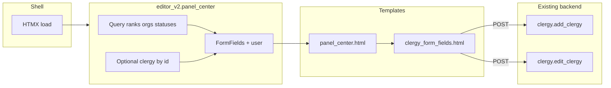

# Center Panel Clergy Form (Editor v2)

## Scope

- **Source of truth for fields**: [templates/clergy_form_content.html](templates/clergy_form_content.html) (lines 14–264 contain the form; ordination/consecration entries are added by JS with names like `ordinations[i][date]`, `ordinations[i][ordaining_bishop_id]`, etc.).
- **Target**: [editor_v2/templates/editor_v2/snippets/panel_center.html](editor_v2/templates/editor_v2/snippets/panel_center.html) — replace placeholder with the form.
- **Constraints** (from [editor_v2/RULES.md](editor_v2/RULES.md)): No inline CSS/JS; Alpine/HTMX/Jinja only; styling lives in `editor_v2/static/v2-styles/`.

## 1. Raw form template (no CSS, no JS)

Create a new **include** that holds only form markup and labels:

- **New file**: `editor_v2/templates/editor_v2/snippets/clergy_form_fields.html`
- **Content** (conceptually):
  - `<form id="clergyForm" method="POST" action="{{ form_action }}" enctype="multipart/form-data">`
  - **form_action**: `url_for('clergy.edit_clergy', clergy_id=clergy.id)` when `edit_mode and clergy`, else `url_for('clergy.add_clergy')`.
  - **Fields** (same `name`/`id` as in clergy_form_content so backend keeps working):
    - Full Name (required), Papal Name (optional, show when rank is Pope — can be hidden by default and shown later via Alpine/JS if desired; for "raw" version either always show or always hide).
    - Organization: `<select name="organization">` with options from `fields.organizations`; optional "Add" button (no `onclick`/JS).
    - Photo: `<input type="file" name="clergy_image" accept="image/*">` and a simple placeholder (e.g. "No photo" text); no drag-drop, no preview JS.
    - Rank (required): `<select name="rank">` with options from `fields.ranks` and `data-is-bishop` on each option for later use.
    - Date of Birth / Date of Death: `<input type="date" name="date_of_birth">`, `name="date_of_death"`.
    - Notes: `<textarea name="notes">`.
  - **Ordinations**: Section heading "Ordinations", a single static block for **one** ordination so the form can submit without JS: e.g. `ordinations[0][date]`, `ordinations[0][ordaining_bishop_id]`, `ordinations[0][ordaining_bishop_input]`, plus validity/checkboxes if you want parity (or a minimal set: date, ordaining_bishop_id). "Add Ordination" as a `<button type="button">` (no handler).
  - **Consecrations**: Section heading "Consecrations"; same idea — one static block `consecrations[0][...]` and "Add Consecration" button. Section visible only when rank is bishop (e.g. `...` for server-rendered visibility; or always include and hide with Alpine later).
  - **Status indicators**: Loop `fields.statuses` — `<input type="checkbox" name="status_ids[]" value="{{ status.id }}">` and `<label>` (text only; no Font Awesome in this snippet).
  - **Admin** (only when `edit_mode and clergy and user and user.can_edit_clergy()`): `mark_deleted`, `is_lineage_root` checkboxes (same names as clergy_form_content). Omit "Manage Metadata" and image editor modal to keep raw.
  - **Actions**: `<button type="submit">Save…</button>`, cancel link (e.g. back to editor shell or `url_for('clergy.clergy_list')`).
- **No** `<style>`, **no** `<script>`, no inline `style=""`. Use minimal class names (e.g. `form-field`, `form-label`) for future styling in `editor.css`; no Font Awesome in this snippet.

## 2. Provide context to the center panel

The form needs: `fields` (ranks, organizations, statuses), `clergy` (or None), `edit_mode`, `user`, and optionally `lineage_roots` for the "Lineage root" checkbox.

- **In [routes/editor_v2.py](routes/editor_v2.py)**:
  - Import from the main app: `request`, `session`; models `Clergy`, `User`, `Rank`, `Organization`, `Status`; and `FormFields` (from `routes.editor` or from a small shared helper to avoid circular imports). If `FormFields` stays in `routes.editor`, use `from routes.editor import FormFields` and ensure editor is loaded before editor_v2.
  - `**panel_center()`**: Read optional `request.args.get('clergy_id')`. Query `Rank`, `Organization`, `Status` (same as editor). If `clergy_id` is present, load `Clergy` with `joinedload` for ordinations/consecrations and bishops; else `clergy = None`. Build `fields = FormFields(ranks, organizations, statuses)`. Get `user` from session (e.g. `User.query.get(session['user_id'])` if `user_id` in session). Compute `edit_mode = bool(clergy)`. Optionally compute `lineage_roots` for the admin checkbox (can defer and pass `[]` if that logic is heavy). `form_action` can be set in the template from `edit_mode` and `clergy`, or passed explicitly.
  - Render `editor_v2/snippets/panel_center.html` with: `fields`, `clergy`, `edit_mode`, `user`, `lineage_roots` (or `[]`).
- **Permission**: If the editor requires `edit_clergy`, protect `panel_center` with the same (e.g. `@require_permission('edit_clergy')`) so unauthenticated users don't get the form.

## 3. Compose the center panel snippet

- **Update [editor_v2/templates/editor_v2/snippets/panel_center.html](editor_v2/templates/editor_v2/snippets/panel_center.html)**:
  - Replace the current "Center panel" div with a wrapper (e.g. `
`) that **includes** the new form snippet: ``.
  - No CSS or JS in this file.

## 4. Wire form submission to the backend

- **No new backend route**: Use existing endpoints.
  - **Add**: `form action="{{ url_for('clergy.add_clergy') }}"`
  - **Edit**: `form action="{{ url_for('clergy.edit_clergy', clergy_id=clergy.id) }}"`
- **Behavior**: Normal HTML form POST. The current `clergy.add_clergy` / `clergy.edit_clergy` views will receive the request and redirect (or return) as they do today.

## 5. Optional: support edit mode from the left panel

- The shell currently loads the center panel with no args. To show the **edit** form when a clergy is selected in the left panel, the left panel would need to trigger an HTMX reload of the center panel with a query param, e.g. `hx-get="{{ url_for('editor_v2_bp.panel_center') }}?clergy_id=123"` (with the selected id).

## Summary

| Item           | Action                                                                                                                                                                                    |
| -------------- | ----------------------------------------------------------------------------------------------------------------------------------------------------------------------------------------- |
| New snippet    | `editor_v2/templates/editor_v2/snippets/clergy_form_fields.html` — form + labels only, same field names as clergy_form_content, one static ordination/consecration block each, no CSS/JS. |
| Center snippet | `panel_center.html` includes the form snippet inside a wrapper div.                                                                                                                       |
| Route          | `panel_center()` in `routes/editor_v2.py` builds `fields`, `clergy` (optional), `edit_mode`, `user`, passes to template; optional `clergy_id` from `request.args`.                        |
| Submission     | Form `action` points to `clergy.add_clergy` or `clergy.edit_clergy`; no new backend; optional later: HTMX post to stay in shell.                                                          |

## Diagram

