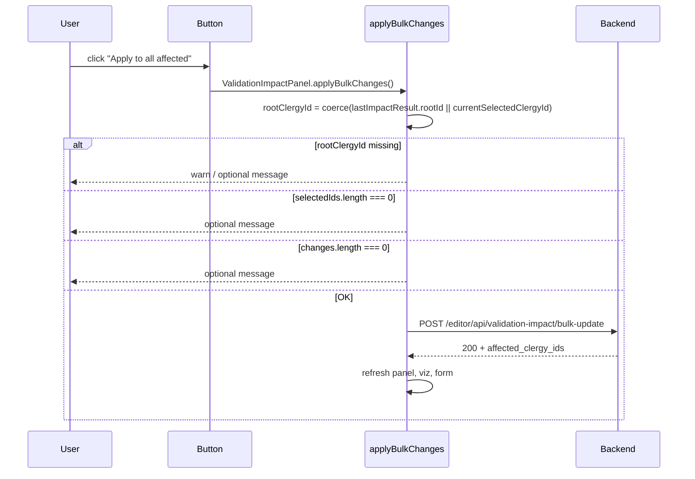

# Fix "Apply to all affected" button in Validation panel

## Root cause

In [static/js/editor-validation-impact.js](static/js/editor-validation-impact.js):

1. **Strict number check for root ID** (lines 1830–1836): `rootClergyId` is taken only when `lastImpactResult.rootId` is `typeof === 'number'` or `window.currentSelectedClergyId` is `typeof === 'number'`. Selection and events often pass IDs as strings (e.g. from `data-clergy-id` or `event.detail.clergyId`), so `rootClergyId` can be `null` and the function returns at line 1839 with only a `console.warn`.
2. **Silent early returns**: When `selectedIds.length === 0` (line 1864) or `changes.length === 0` (line 1909), the function returns with no user-visible feedback.

The click handler itself is correctly attached (lines 1801–1808) and calls `ValidationImpactPanel.applyBulkChanges()`; the issue is inside `applyBulkChanges`.

## Changes

**File: [static/js/editor-validation-impact.js](static/js/editor-validation-impact.js)**

1. **Coerce root clergy ID to number** (around 1828–1838):
  - Derive `rootIdFromImpact` from `lastImpactResult.rootId` by coercing with `Number()` or `parseInt(..., 10)` and `Number.isFinite()` instead of requiring `typeof === 'number'`.
  - Derive `globalRootId` from `window.currentSelectedClergyId` the same way.
  - Set `rootClergyId = rootIdFromImpact ?? globalRootId` (use the first that is a finite number).
  - Ensure the value sent in the JSON body is an integer (e.g. `Math.floor(rootClergyId)` or already integer after coercion).
2. **Optional but recommended – user feedback on early exit**:
  - When `!rootClergyId`: keep `console.warn`; optionally show a short message (e.g. notification or `alert`) so the user knows why nothing happened.
  - When `selectedIds.length === 0`: show a short message (e.g. "No descendants selected. Check 'Update this clergy' for the ones to update.").
  - When `changes.length === 0`: show a short message (e.g. "No validity changes to apply for the selected descendants.").

No backend or template changes are required; the backend already expects an integer and the panel markup is correct.

## Flow (reference)

